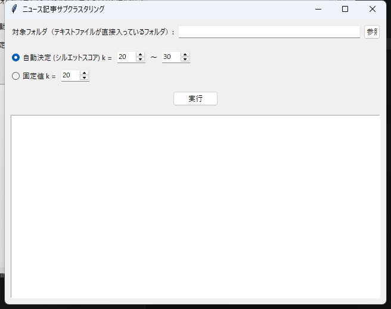
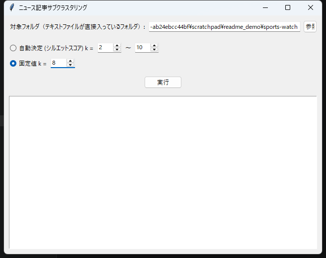
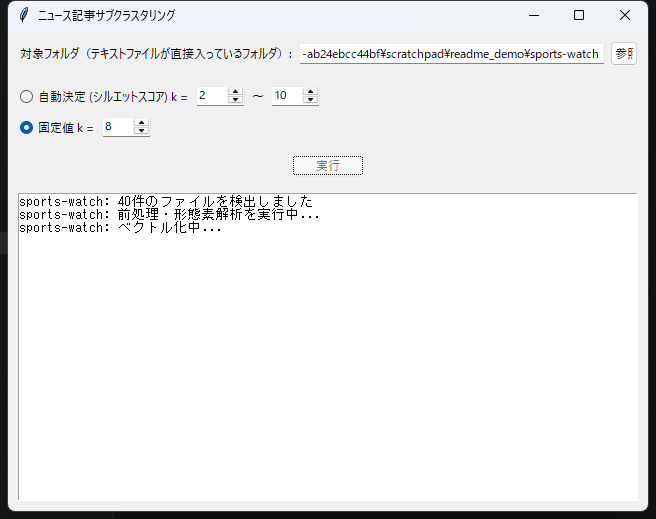
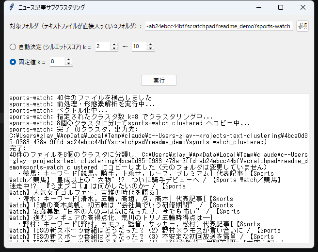
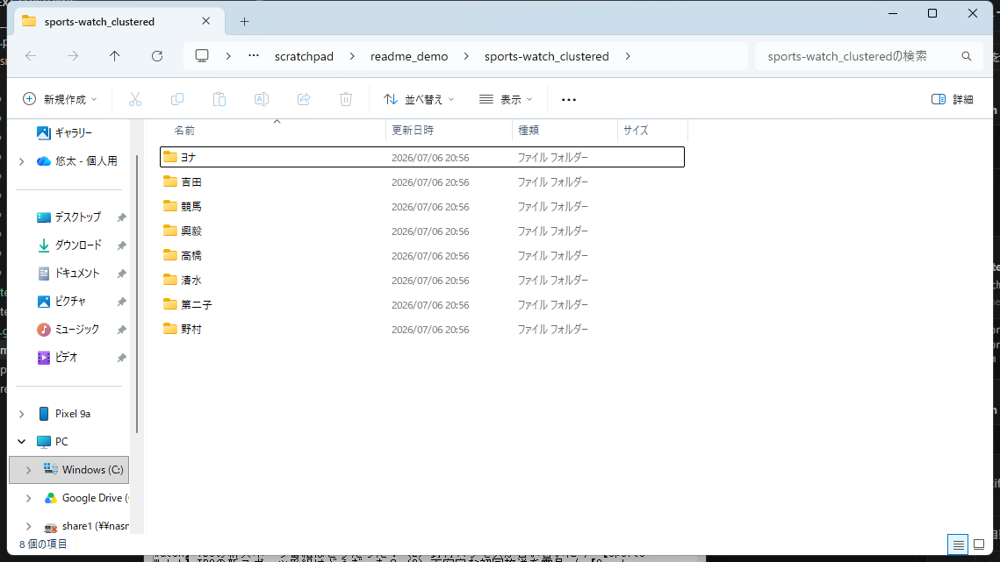

# ニュース記事サブクラスタリング

ジャンル別フォルダに整理されたニュース記事を対象に、各ジャンル内でさらに意味的な
サブグループ（サブクラス）へ分類するデスクトップアプリです。GUIでフォルダを選ぶだけで、
元のファイルには一切手を加えず、クラスタごとに命名されたサブフォルダへ記事の**コピー**を
作成します。

## 特徴

- **元データは一切変更しない** — 対象フォルダの中身は読み込むだけで、結果は同じ階層に
  作成される `<フォルダ名>_clustered` という新しいフォルダにコピーされます。
- **日本語テキストの前処理** — 英数字は半角、かなは全角に統一し、空白を除去したうえで
  SudachiPyによる形態素解析を行い、助詞・助動詞・数詞・代名詞・汎用的な名詞（ストップ
  ワード）を除いた内容語のみを抽出します。
- **多言語Sentence-BERTによるベクトル化** — `intfloat/multilingual-e5-small` で記事を
  埋め込みベクトル化し、KMeansでクラスタリングします。
- **クラスタ数はGUIで調整可能** — シルエットスコアによる自動決定、または固定値を指定できます。
- **クラス名は BERTopic 方式の c-TF-IDF で自動生成** — クラスタに属する記事をすべて連結し、
  クラスタ間でTF-IDFに似たスコアを計算することで、ジャンル全体で頻出する一般的な語
  （例:「映画」ジャンルにおける「映画」自体）を避け、そのクラスタに固有の語を
  フォルダ名として採用します。
- **代表記事タイトルの提示** — 各クラスタについて、クラスタの重心にコサイン類似度が
  近い記事のタイトルをいくつか表示し、そのクラスタがどんな内容かを一目で把握できます。

## 設計思想

このアプリは特定の対象ジャンルや利用目的に特化せず、**汎用性を重視**して設計されています。
「クラスタリングによって何を見つけたいか」（例: 事件の種類、登場人物、地域など）を
あらかじめ指定する仕組みは持たず、統計的な指標（c-TF-IDF・シルエットスコア）のみに
基づいて機械的にグループ分けと命名を行います。

そのため、生成されるクラス名やクラスタ内のファイルの組み合わせが、必ずしも
ユーザーが期待する観点（トピック、感情、固有名詞など）と一致するとは限りません。
結果はあくまで統計的な類似性に基づく一つの分け方であり、目的に応じて`固定値k`や
クラスタ数を調整しながら、最終的な妥当性はユーザー自身の判断で確認してください。

## 動作環境

- Windows
- Python 3.13

## セットアップ

このプロジェクトは仮想環境を使わず、グローバルのPython環境に依存パッケージをインストール
する構成になっています。

```powershell
python -m pip install -r requirements.txt
```

主な依存パッケージ:

| パッケージ | 用途 |
|---|---|
| `sudachipy` / `sudachidict_core` | 日本語形態素解析 |
| `jaconv` | 全角・半角変換 |
| `scikit-learn` | KMeans・TF-IDF・シルエットスコア |
| `sentence-transformers` | 文書の埋め込みベクトル化 |
| `numpy` | 数値計算 |
| `pytest` | テスト実行 |

初回実行時、`sentence-transformers` が埋め込みモデル（`intfloat/multilingual-e5-small`）を
Hugging Face Hubから自動ダウンロードします（数百MB程度、初回のみ）。

## 使い方

```powershell
python main.py
```

起動すると以下のウィンドウが表示されます。



### 1. 対象フォルダを選択する

「参照...」ボタンから、**テキストファイル（.txt）が直接入っているフォルダ**を選びます
（ジャンルフォルダそのものを選んでください。ジャンルフォルダを複数含む親フォルダでは
ありません）。

### 2. クラスタ数を設定する

- **自動決定（シルエットスコア）**: 指定した範囲（k_min〜k_max）の中から、シルエット
  スコアが最も高いクラスタ数を自動的に選びます。ジャンル内の記事同士が意味的に近い
  場合、この方式は大雑把な分割（例: k=2）を「最適」と判断しがちです。より細かく
  分類したい場合は次の固定値モードをお勧めします。
- **固定値**: クラスタ数を直接指定します。記事数が多いフォルダほど大きめの値
  （20〜30程度）を指定すると、具体的なテーマ単位で分類されやすくなります。



### 3. 実行する

「実行」ボタンを押すと、バックグラウンドで前処理・ベクトル化・クラスタリング・
コピーが進行し、ログにリアルタイムで進捗が表示されます。



完了すると、クラスタごとの件数・キーワード・代表記事タイトルがログに一覧表示されます。



### 4. 結果を確認する

対象フォルダと同じ階層に `<フォルダ名>_clustered` フォルダが作成され、その中にクラスタ名の
サブフォルダと、コピーされた記事ファイルが格納されています。元のフォルダの中身は
変更されていません。



## 処理の流れ

```
対象フォルダ内の .txt ファイルを読み込み
        ↓
URL・日時のヘッダー行を除去し、タイトル＋本文を抽出
        ↓
全角/半角の正規化 → 空白除去（メモリ上でのみ処理、元ファイルは変更しない）
        ↓
SudachiPyで分かち書き → 助詞・助動詞・数詞・代名詞・ストップワードを除外した名詞のみ抽出
        ↓
Sentence-BERTでベクトル化
        ↓
KMeansでクラスタリング（自動決定 or 固定値）
        ↓
c-TF-IDFでクラスタごとの代表キーワードを抽出し、フォルダ名を決定
        ↓
重心に近い代表記事タイトルを抽出
        ↓
各記事ファイルを <フォルダ名>_clustered/<クラスタ名>/ へコピー
```

## プロジェクト構成

```
main.py                    # エントリポイント（GUI起動）
src/
  gui.py                   # tkinter GUI
  pipeline.py              # 1ジャンルフォルダ分の処理を統括
  text_normalizer.py       # 全角/半角変換・空白除去
  tokenizer.py             # SudachiPyによる分かち書き・ストップワード除去
  embedder.py              # Sentence-BERTによるベクトル化
  clusterer.py             # KMeans（自動/固定k）
  labeler.py               # c-TF-IDFによるキーワード抽出・クラス名決定・代表記事抽出
  namer.py                 # フォルダ名のサニタイズ
  file_organizer.py        # ファイルのコピー（移動・書き換えは行わない）
tests/                     # pytestによるテスト（TDDで実装）
```

## テストの実行

このプロジェクトはTDD（テスト駆動開発）で実装されており、機能ごとにテストが用意されています。

```powershell
python -m pytest -q
```

## 注意事項

- 対象フォルダ内に記事以外の `.txt` ファイル（ライセンスファイルなど）が含まれていると、
  記事として扱われてしまいます。事前に除いておくことをお勧めします。
- クラスタ数を大きくしすぎると、1クラスタあたりの記事数が少なくなり、代表キーワードが
  不安定になることがあります。記事数とクラスタ数のバランスを見ながら調整してください。
